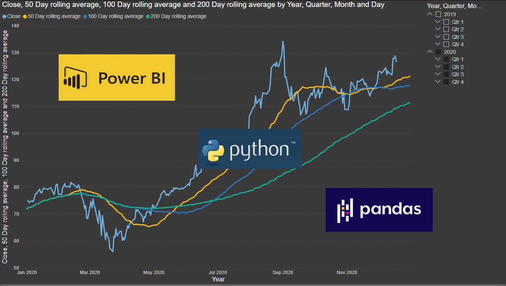
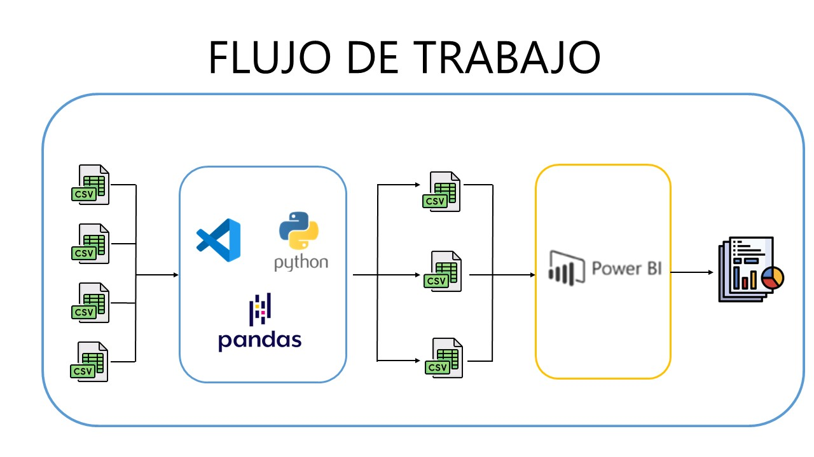

# <h1 align=center>**PROYECTO INDIVIDUAL N°2 DATA ANALYTICS**</h1>

_Autor: Hugo Gómez Tinoco_

Bienvenido! En este proyecto haremos un análisis de los MOOCs (Cursos online, abiertos y masivos), para esto, se iniciará con una carga y limpieza de datos. Para así poder hacer un análisis exploratorio de datos y buscar relaciones entre variables. Y así posteriormente armar un reporte en PowerBI, todo esto para poder ayudar a una startup de tecnología que planea unirse a este mercado tan competitivo.

## **Índice**

- [Fuente de datos](#fuente-de-datos)
- [Desarrollo](#desarrollo)
  1. [Análisis exploratorio de datos](#1-eda)
  2. [Nube de palabras](#2-nube-de-palabras)
  3. [Dashboard](#3-dashboard-con-powerbi)
- [Conclusiones](#conclusiones)
- [Tecnologías Utilizadas](#tecnologías-utilizadas)

## **Fuente de datos**

Para realizar este trabajo se utlizaron los archivos .csv ubicados en la carpeta [data](/data) y un archivo más en la carpeta de Google Drive con el nombre de [Coursera_reviews](https://drive.google.com/drive/folders/1dy0guo90qt4m528et_QoNBtjHahy31qN) este mismo se deberá colocar en la carpeta data si desea correr el Notebook.

## **Desarrollo**

Se estudiarán las siguientes plataformas:

### **1) EDA**

Se utilizó la libreria de _Pandas_ para leer los datos de los csv, además de unificar los dos datasets de Coursera y también hacer una pequeña limpieza de datos, y también para poder exportar los datos a nuevos csv que se utilizarán en el dashboard de Power BI y también para la creación de una nube de palabras. Además se utilizaron las librerías de _Matplotlib_ y _Seaborn_ para el análisis de los datos.

- El código se encuentra en el notebook: [EDA](/EDA.ipynb).

### **2) Nube de palabras**

Se leen los títulos exportados en el EDA y se procede a la generación del Word Cloud (Nube de palabras) con las librerías _word_cloud_ para la generación de la nube y la librería _NLTK_ para obtener las STOPWORDS (Palabras que son irrelevantes para el análisis) en inglés y español. Luego se procede a generar y exportar la imagen con la librería _Matplotlib_.

- El código se encuentra en el notebook: [word_cloud](/word_cloud.ipynb).

### **3) Dashboard con PowerBI**

Hacemos una presentación con los CSV exportados del primer paso, esta presentación interactiva está hecha con Power BI y permite una mejor visualización de los datos así como las relaciones entre las variables para así llegar a una conclusión de los datos.

- El Dashboard se encuentra en el archivo: [Dashboard](https://drive.google.com/drive/folders/1dy0guo90qt4m528et_QoNBtjHahy31qN).

## **Conclusiones**

Después de analizar exhaustivamente los datos se puede concluir en que:

- Los cursos con mejor promedio de reviews son cursos impartidos por Universidades.

- Los cursos de desarrollo web y computer science, ya sean gratis y de pago son los cursos con más personas inscritas.

- Hay mucha oferta de cursos de nivel principante mientras que los cursos de nivel avanzado son pocos.

- Los cursos gratuitos tienen buena tasa de conversión para atraer gente a cursos pagos.

- Los cursos impartidos en vivo por algún profesor son muy bien recibidos y es un hueco en el mercado muy interesante.

## **Tecnologías Utilizadas**

- [Python](https://www.python.org/)
- [Pandas](https://pandas.pydata.org/)
- [Matplotlib](https://matplotlib.org/stable/index.html)
- [WordCloud](https://pypi.org/project/wordcloud/)
- [PowerBI](https://powerbi.microsoft.com/es-es/)

## **_¡Gracias!_**
